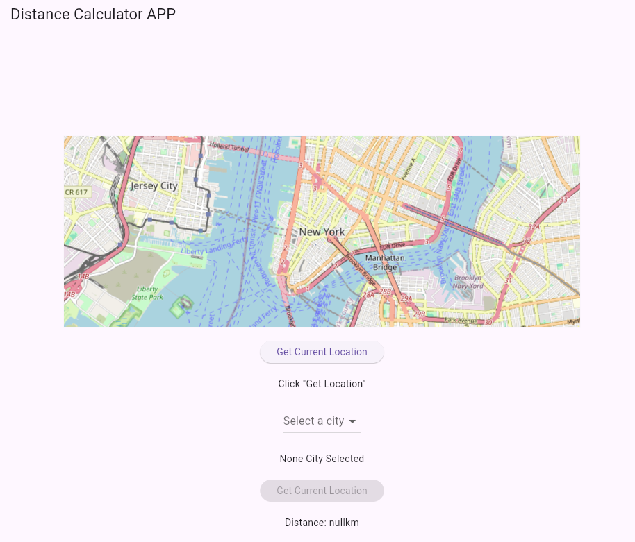
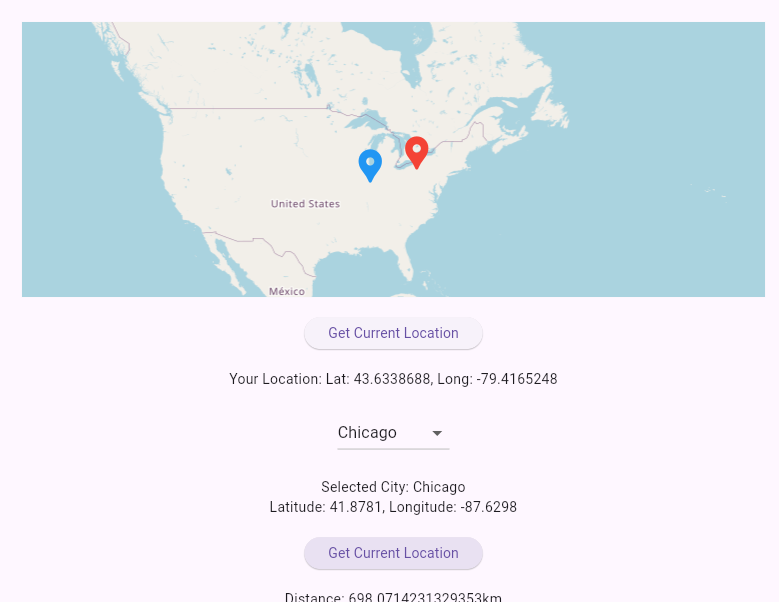
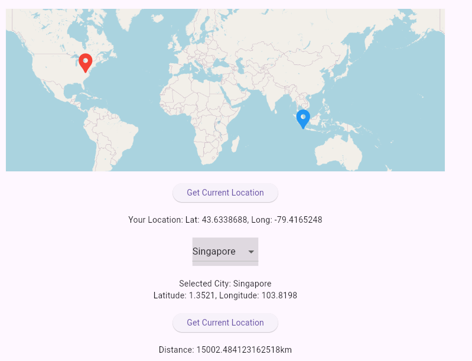

# interview Task 

Create a mobile application in flutter that does the following:
1. Display the user's last know location 
2. Asks the user to pick one of the following cities: Chicago, New York, Paris, Singapore.
3. Calculates and displays the distance from #1 to the city picked in #2.

# Dependenies 
  geolocator: ^13.0.1
  flutter_map: ^7.0.2
  latlong2: ^0.9.1
  geocoding: ^2.1.0

# Runing Instruction
1. flutter pub get -> Get Dependency
2. flutter run -d chrome -> run Flutter Application

# Demo 

After launch the web there are 4 elements: Map, Get Loction Button, Dropdown Bar, Calculate Button
1. Click "Get Location Button": Get the current location information Long and Lat => output: 1. Map shows your location 2. See the Long and Lat Information
2. Select City with Dropdown Elements: Get the citys information => output: 1. Select city name and location info 2. Add Select City Mark to the Map
3. Click "Calculate Button": calculate the distance by lat and long information. => output: 1. Zoom the map shows two location 2. Distance information

## Example 1 Chicago

## Example 2 Singapore

